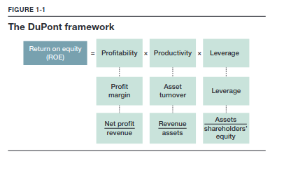
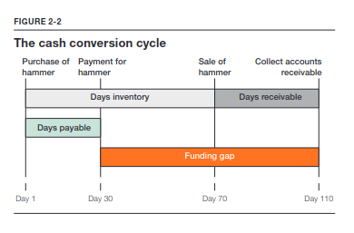
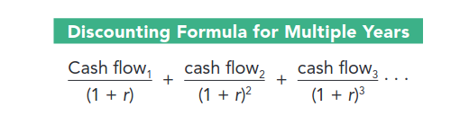

---
layout: page
title: How Finance Works - Mihir Desai
--- 

# 1. Financial Analysis
Using ratios to analyze performance 
 

## Understanding the numbers

### Assets

An asset is a resource with economic value that an individual, corporation, or a country owns with the expections.

For e.g., Haagen Dasz owns the _ice cream_ that it is going to sell, the _factories_ and _raw materials_ to make the ice cream, and the _trucks_ to deliver it.

Assets are ordered by the degree to which they can be turned into cash. Assets that can easily be converted into cash are called current assets, and they appear at the top.

#### Cash and Marketable securities.
Large cash holdings can generally be understood as
* an insurance policy during uncertain times
* a war chest for making future acquistions
* a manifestation of the absence of investment opportunities.

Much of the cash is held in government securities so that they can quickly be converted into cash if the need arises.

#### Accounts receivable 
Accounts receivable are amounts that a company expects to receive from its customer in the future. As trust grows in a relationship between a company and its customers, the company might be willing to allow customers to pay later.

Companies that sell to other companies have a higher amount of sales reflected as receivables compared to businesses that sell direct to consumers.

#### Inventories
Are the goods or raw materials that become the goods that a company intends to sell. 

#### Property, plant, and equipment
It is the term for the tangible, long-term assets that a company uses to produce or distribute its products.

#### Other assets:
Likely to be intangible assets. Things you cannot put your hands on ut are valuable nonetheless - things like patents and brands.

For e.g., Coca-Cola has a very valuable brand, maybe the most valuable thing it owns but it really does not know valuable it is. So accountants ignore it. That's the accounting principle of conservatism.

When another company acquires another company for more than the value of its assets on their balance sheet, the difference is typically recorded on the acquiring company's balance sheet as goodwill. 

Microsoft spent $26.2 billion in 2016 to acquire LinkedIn, which had assets with a book value of $7.0 billion. The $19.2 billion Microsoft paid above the book value will show up as goodwill. 

### Liabilities and Shareholder's Equity
This section provides information on how companies finance themselves. There are two souces of finance for purchasing assets - lenders and owners. Liabilities represent those amounts financed by lenders to whom the company owes amounts. Shareholder's equity, or net worth, corresponds to the funds that shareholder's provide.

`Shareholder's equity = Assets - Liabilities`

Liabilities are ordered by the length of time companies have to repay them and liabilites that need to be paid back soon are labeled "current."

#### Accounts payable and notes payable
Accounts payable represent amounts due to others, often over ashort time, and typically to the company's suppliers. 

#### Accrued items
Broadly represents amount due to others for acitivities already delivered. One example is salaries: a balance sheet may be produced in the middle of a pay period, and the company may owe salaries that have not been paid yet.

#### Long-term debt
Unlike other liabilities, debt is distinctive because it has an explicit interest rate. 

#### Preferred and common stock
Shareholder's equity represents an ownership claim with a viable return. - in effect the owners get all residual cash from the business after costs and liabilities. Debt has a fixed return (i.e. interest rate) and no ownership claim. It gets paid before equity holders in the event of a bankruptcy. Equity holders have a variable return and an ownership claim but can be left with nothing if a company goes bankrupt. Typically, shareholders' equity, net wroth, owner's equity and common stock are all synonyms effectively. Shareholders' equity is not the amount originally invested in the company by the owners. As a company earns net profits, those profits can be paid out as dividends or be reinvested in the company. These retained earnings are a component of shareholders; quity as if the owners received a dividend and reinvested it in the company.

`Preferred stock` is often called a hybrid instrument. It combines elements of both debt and equity claims. Like debt, preferred stock dividend can be fixed and paid before common stock dividends. But like equity, it is paid after debt in the event of a bankruptcy. The unique attributes of preferred stock can allow a company to finance itself during precarious times.

## Understanding Ratios
Provides comparability across companies through time. 

#### Liquidity 
Measure the risk by emphasizing the company's ability to meet short-term obligations with assets that can be quickly be converted into cash. 

`Current Ratio = Current assets / Current liabilities`

Current ratio asks a question on behalf of a company's suppliers" Will this company be able to pay its suppliers if it needs to close. 

`Quick Ratio = (Current assets - inventory)/ Current liabilities`

The quick ratio resembles the current ratio, but excludes inventory. When a product goes obsolete the inventory should be considered worthless. It provides a more skeptical view of the company's finances.

#### Profitability
For every dollar of revenue, how much money does a firm get to keep after all relevant costs? 

`Profit Margin = Net Profit/ Revenue`

For every dollar of quity that shareholders invest in a business, what is their annual flow of income? 

`Return on Equity = Net profit/ Shareholders' equity`

Return on assets answers the question: How much profit does a company generate for every dollar of assets? This explains how effectively a company's assets are generating profits.

`Return on Assets = Net Profit/ Total Assets`

`EBIT`is also known as _operating profit_. Since some companies have different tax burdens and capital structures, EBIT provides a way to compare companies more directly.

`Depreciation` refers to how physical assets such as vehicles and equipment lose value over time. 

`Amortization` refers to the same phenomenon but for intangible assets.

### Financing and Leverage.
Let's consider your own personal balance sheet after buying a home. What if no mortgages were available for you to buy a home? If you had $100, you could only buy a home that was worth $100. With a mortgage market, you can borrow money to buy a home that is worth, say, $500.

In effect, leverage allows you to live in a house you have no write to live in.
Here's the big question: Are you richer in case A or case B? - No difference, you have a shareholders' equity of $100.

If the value of the house increases by 10 percent. In case A, the return to your shareholders' equity is 10 percent, but in case B, the return in 50 percent if the house value goes to $550. The mortgage remains at $400.

If the house declines by 20 percent the return in case A is -20 percent. But in case B, the return is -100 percent! So managing leverage is critical because it enables you to do things couldn't do otherwise. 

_It magnifies returns in both directions._

The ratio of total debt to total assets measures the proportion of all assets financed by debt. It provides a balance sheet perspective on leverage.

`Debt to Assets = Total Debt/ Total Assets`

The ratio of long term debt to capitalization provies a somewhat more subtle measure of leverage by emphasizing the mix of debt and equity. 

`Debt to capitalization = Debt / Debt + Shareholders' equity`

Leverage provides the ability to control more assets an owner would otherwise have the right to control. Assets to Shareholders' Equity tells us precisely how many more assets an owner can control relative to their own equity capital. As a consequence it also measure _how returns are magnified_ through the use of leverage.

`Assets to Shareholders' Equity = Assets / Shareholders' Equity`

The ratio of EBIT to interest expense measure a company's ability to fund interest payment from its operations.

`Interest Coverage Ratio = EBIT/ Interest Expense`

### Productivity or Efficiency

Asset turnover measures how effectively a company is using its assets to generate revenue. This is a critical measure of a company's productivity.

`Asset Turnover = Revenue / Total Assets`

Inventory turnover measures how many times a company turns overs or sells all its inventory in a given year. The higher the number, the more effectively the company is managing its inventory as it sells products.

`Inventory Turnover = Costs of Goods SOLD (COGS) / Inventory`

We can use this turnover number to get another measure of inventory management: days of inventory. 
It provides the average number of days a piece of inventory is kept inside a acompany before it is sold. 

`Days of inventory = 365 / Inventory Turnover`

After a company sells its inventory, it needs to get paid for it. The lower this figure, the faster a company is getting cash from its sales. 

`Receivable Collection Period = 365 / (Sales/ Receivables)`

### Identifying industries based of Ratios

#### Service Companies
Since these provide services rather than tangible goods, they do not hold any inventories - E, G, M, and N. 

#### Company N
Owns a lot of receivables and takes a long time to collect. Large part of their financing comes from notes payable.- Bank. 
The loans that you consider as your liabilities are a bank's assets. Banks run a "spread" business. Where they charge you more for loans than they give you on your deposits. 

#### Capital-intensive service providers
Companies E and M have much more property, plant and equipemnt. The most significant differences between these two companies is that M gets paid in seven days on average which likely means it sells mostly to individuals. In contrast E takes longer to collect, which would suggest that it's much more likely to be selling to other businesses. 
Company E has a lot of other liabilities. These liabilities are pension obligations to retirees. 

#### Cash rich, equity-dependent service company
Company G has a large amount of equity and lots of cash. This company is Facebook. High equity number can coincide with younder companies. As, the company has matured it has completed a number of large acquisitions: Whatsapp and Instagram. These would reduce cash on the balance sheet and show up of goodwill.

#### Retailers
Since retailers sell goods directly to customers, their receivables collection period is going to be shorter because the customers pay immediately via cash or credit. In contrast, businesses that do business with other businesses give credit of a minimum of 30 days. - A, B, H, I and K.

#### Companies with distinctive inventory turnover
Company H turns their inventory over 32 times a year. They have eleven days of inventory at any time. This is Yum! Grocery chain also has perishable goods but it also has a selection of dry and canned foods making it turnover considerably slower than a restaurant chain.

At the other extreme, B turns over inventory really slow ~90 days. This is a bookstore. It is also losing money, shows up in the negative profit margin. B also is the only company that has preferred stock indicating its troubled financial position.

#### The final three retailers
Out of the remaining 3 retailers, A has the lowest property, plant and equipment. This could be Amazon. A has a large amount of payables which could mean that it is in trouble or that it is granted credit easily by suppliers because of its size. Given the amount of cash that they have on their balance sheet, we know they are not in financial trouble. 

Company I has more PP&E compared to K. Company I also receives more immediate payments and inventory turnover is faster indicating its a grocery chain. Whereas K, is a drug store that gets revenue from insurance companies. 

#### The Stragglers

Three companies have barely any PP&E while the remaining two have significant PP&E. One is likely Duke Energy whereas the other is Nordstorm. The other 3 companies Microsoft, Pfizer and Dell dont really do any heavy amnufacturing so it makes sense. 

The key differentiating factor between Duke and Nordstorm is that Nordstorm would have more inventory compared to an Energy company. So L is Duke and J is a retailer Nordstorm. ALso, the big EBITDA margin for company L means large amount of depreciation and amortization. That's what utilities do. 

OF the last three C has a really low profit margin. Whereas D and F, have astounding profit margins and EBITDA margins. This type of commodification has happened in the laptop industry. Also C holds inventory for 10 days, which matches Dell's just-in-time business model. Only starts manufacturing after it takes orders, keeping inventories as low as possible.

Out of the remaining two companies, D has a lot of other assets, it probably means an intangible capital-intensive industry that has been consolidating. Pfizer has had a long string of acquisitions. D is Pfizer and F is Microsoft. Another piece of confirmatory evidence is that D has more other liabilities than F. Confirming that Pfizer has an old-style pension plan, and F holds large balances.

### DuPont Framework

The dupont framework breaks return on equity(ROE) into 3 ingredients. Profitability, Productivity and Leverage. 

**Profitability**: Goes back to the notion of profit margin. For every dollar of revenue, how much does it earn in profit.

**Productivity**: Use asset turnover ration, which measures how efficiently a company can use its assets to generate sales.

**Leverage**: Magnifies returns. Divide company's assets by its shareholders' equity.

### Profound changes at Timberland

Timberland is a manufacturer and retailer of rugged outdoor activity. Looking at its numbers and comparing it with the industry, we see that ROE is almost close to the average but it largely comes from leverage. That means that it is overcoming its poor operational performance by taking more risk.

Return on capital also known return on invested capital. It considers both capital providers and their combined return. 

`Return on Capital = EBIAT/(debt+equity)` 

Other numbers that also tell us about poor performance is "times interest earned " (how many times it can cover its interest payments from operating earnings) and inventory turnover rate.

Its receivables are also out of whack (73.5 vs 39.1). the management not being aggressive about collecting cash owed to the company. 

A year later we can see that the ROE is negative, which is driven by negative profitability. Productivity is up a little and leverage has decreased. The times interest earned went from over three to one. Indicating that Timberland did not have enoudh operating profit to make its interest payments. First, inventory turnover increased markedly, while gross margins dipped significantly. This indicates a fire sale of sorts. Liquidating goods to raise cash to make payments. Its receivables collection period dropped by 20 days. The payable period also decreased, indicating that the suppliers were unlikely to extend credit based on the financial situation.

Timberland was moving more inventory not by cutting prices. Its profit margin was improving and leverage coming down. Its gross margin indicates pricing power just as it was moving more goods.

# 2. The Finance Perspective

**The Conservatism Principle** 
Implies that the companies should record lower estimated values of their assets and higher estimation of their liabilities. They err on the side of being conservative. Thus, balance sheets typically record assets at their historical cost, not their current replacement value. 

**The Rules of Accrual Accounting**
Try to smooth out both revenues and costs in an effort to better reflect the accounting reality. They allow a company to capitalize an investment as an asset, and to expense it as depriciation charges every year over the asset's entire life. Foer example, Airbus Group, built a new factory that cost $600 million. Because of accrual accounting Airbus would report more moderate profits over time rather than losses in 2015 and then profits after the plant started production. This represenation of profits is quite distinct from their true cash outflows, obscures time value of money, and may reflect managerial discretion while cash flows would not.

## What we talk about When talk about Cash
Accounting asks managers to make decisions in order to smooth returns, as accountants consider that to be more consistent with reality. For e.g., an up-front payment for piece of equipment has to be capitalized, placed on the balance sheet, and then depcriated over time. Revenue similarly may need to be recognized over time. But this process of smoothing measures of performance is subjective, which allows managers to manipulate profits to their advantage. In contrast, cash is cash and, arguably, is not susceptivle to similar levels of managerial discretion.

To build an alternative foundation for assessing economic returns, we need to identify cash flows as opposed to profits. 

`EBIT` is gives a view of how efficient and profitable a company is relative to net profit by not considering taxes and interest(not related to operational performance). It is still not quite a measure of cash, because it is calculated by subtracting noncash expenses such as depreciation and amortization. 

For a fuller picture, finance professionals turn to `EBITDA`: earnings before interest, taxes, depriciation, and amortization.

EBITDA can be more relevant for some industries than others. In 2015, the depriciation to net income ratios of EA, The Michaels Comapies, and Comcast were 17%, 34% and 106%. Comcast heavily invested to create a nationwide cable and internet network. Because of those heavy investements, using net profit as a measure can be flawed in comparison to EA that is a software company.

### Amazon's Net Profit, EBIT and EBITDA

In 2014, Amazon's EBIT was $178 million, and Net Profit was -$241 million, and EBITDA was $4.76 billion. So Amazon generated a lot of cash as measured by EBITDA, but gas losses according to profitability measures. 

### From EBITDA to Operating Cash Flows
Given the obsession with cash, there exists another statement dedicated to it - Cashflow statement. It is often considered the most important financila statement.

Income statement has the problem noncash expenses as well as managerial discretion, whereas, the balance sheet, has the problems of historical accounting and conservatism.

Operating cash flow is distinct from EBITDA in several ways. First, it cosiders the cost of working capital, and, second, it considers tax and interest payments by beginning with net profit. It includes noncash expenses other than depriciation and amortization and stock based compensation in its final calculation.

The investing section emphasizes the ongoing investments that bypass the income statement and go straight into the balance sheet. Such as CapEx, and acquisitions.

The financing section examines whether a company has offered debt or paid back debt, or issued equity or brought back stock, and reveals the cash consequences of doing so.

### Working Capital
It is the capital required by the company to fund its day to day operations. 

`Working Capital = Current Assets - Current Liabilities`

A slightly more narrow way to define working capital

`Working Captial = Accounts Receivable + Inventories - Accounts Payable`

One simple way to think about the consequences of working capital is to note that the daily operations of the company result in an amount that needs to financed like any other asset. If the amount of working capital is lowered, that lowers the financing needs of the company. '

###k The cash conversion cycle

A powerful way to frame the financing consequences of working capital is to frame woring capital temporally rather than monetarily. This framing is called the cash conversion cycle.

For example, if you had a store where you bought hammers from wholesellers and sold them to home improvement professionals. There are several transactions with a single hammer and they dont happen all at once. You first buy the hammer, pay for it, sell it and collect the cash for the sale. If you sell the hammers 70 days from the day you bought it, and you dont get paid for another 40 days. It takes a total of 110 days from the time that you have bought the hammer to getting cash for it. In addition, you pay cash for the hammer 30 days after you have bought it. 

From a cash perspective, you need to generate cash to pay for the hammer - 80 Days if companies pay before getting paid, they must finance these shortfalls in their cash conversion cycles.

In a recession, companies hold on to their inventories for longer and even when they do sell a hammer, the contractor who is getting squeezed by his customers will take longer to pay up. 

Let's return to the hardware store. A supplier encourages you pay within 10 days by offering a 2% discount is that a good deal? The alternative is a bank that charges 12% a year. That is less than 1% to fund the 20 days if you took the deal from the supplier. 

**Note:** Companies such as Salesforce.com that have a software-as-a-service business, they typically, have a negative cash conversion cycle. It has no inventory. By taking payments first and then providing services, these payments are used to finance its operations.

#### How Amazon Grows ... and Grows 

Amazon manages its inventories, receivables, and payables in such a way that it has a negative working capital. In 2014, Amazon averaged 46 days of inventory, and it collected from its customers after 21 days. Due to its market dominance, it can make it suppliers wait before getting paid. And it averaged 91 days to pay its suppliers. This becomes a source of cash. Likewise Apple, uses it negative working cycle to grow rapidly without seeking external financing. 

### Free Cash Flow

The final cash measure is free cash flows, one of the most important measures of economic performance in finance. The equation for calculating free cash flows provides a measure of the amount of cash flows unencumbered by the operations of a business. It's the purest measure of cash andforms the basis of valuation. It removes the distorting effects of non cash charges such as Depriciation and Amortization, accounts for changes in the working capital and acknowledges capital expenditures required for growth.

The net assets side of the balance sheet is divided in working capital and fixed assets (PPE) and the financing side of the balance sheet is divided into debt and equity. This modified balance sheet now distinguishes between the operations and the the capital providers. The flow of operations generate that end up with the capital providers. 

The operations of the business generate EBIT, but the government takes it shares to make it EBIAT. From there, you must consider the company's ongoing investment into working capital and fixed assets as it grows. Finally, noncash expenses that should have never been expensed must be added back. What's left is the free cash flow.

#### Amazon vs Netflix.

Amazon seems not to have made profits at least until very recently. By the profit metric, Netflix appears to be more profitable than Amazon. With a profit margin of 5% relative to Amazon's 2%. 

Now, look at their respective operating cash flows. In Amazon's case, the cash flow engine is being driven by all its noncash expenses and its management in working capital. On the other hand, Netflix, has negative cash flows because og its heavy investments in content. In short , they are buying increasing amounts of content and quickly ammortizing it, creating a cash drain.

Finally, looking at their free cash flows. Considering capital expenditure changes the view a bit more. Netflix doesn't have significant CapEx, or free cash flow aren't considerbly worse than cash from operations. Amazon has more significant CapEx so it is free cash flow negative.

## Fixated on the Future

The source of all value today is future performance manifested in cash flows. That creates a problem for finance as not all future cash flows are created equal. $1 today is worth more than $1 tomorrow. Similarly, $1 a year from now. But how much less? That depends of the opportunity cost of that money. What could you have done with the money if you did not have to wait? Once you figure that out, you then "punish" future cash flows by assessing penalty that accounts for that oppotunity cost. That's called a discount rate.

### Discounting

Let's say you get 10% by keeping your money in a bank. So after a year you have $1.10. That's the first clue that $1 today is worth more than a $1 1 year from now.

As a consequence, now you know how to punish future cash flows for making you wait to receive them. Every time you have to wait a year, you "haircut" future cash flows by _one plus the interest - (1 + r)_ because that's what you would have earned if you hadn't had to wait.

For example, you want to figure out how much $1000 received 1 year from now is worth today. Assume that a bank would have offered you an interest rate of 5%. 
The present value of $1000 received a year from now is $952.38 as $952.38 put in a bank today would give you $1000 after a year. If the interest rates rises to 10% it would be $909.09.

### Multiyear Discounting

What if you have cash flow over multiple years into the future? You can simply discount the multiple cashflows. 

Suppose the bank is offering a $1000 payment for each of the next three years and the prevailing interest rate is still 5% percent. 

When you add the three values together, you arrive at how much the much the bank's offer is worth today

(1000 / (1 + 0.05)) + (1000 / (1+0.05) ^ 2) + (1000 / (1+0.05) ^ 3) = 952.38 + 907.03 + 863.84 = $2723.25

**The impact of discount rates**

### Sunk Costs and Net Present Value

Sunk costs are costs that have alredy nee incurred and can't be recovered. While accounting carefully considers them in balance sheets and income statements, finance professionals view the amount paid for an asset as gone forever.

For example, a company spends $100,000 to research a new product. Those amounts are gone and can never be recovered. Even the time spent on planning, creating and launching the product are gone.

In short, assessing the values requires you to:
* look into the future
* think abou the incremental cashflows that will be generated over time
* discount them back to the present value

For example, assume Nike is building a new shoe factory at a cost of $75 million. The plant will produce $25 million in cash every year from the shoes Nike is able to make and sell, fro the next five years. Assuming a 10% percent discount rate for this project

Nike Factory Present Value = (25/(1.10)^1) + (25/(1.10)^2) + (25/(1.10)^3) +(25/(1.10)^4) + (25/(1.10)^5) = $94.8 million

By paying $75 million for a project, Nike is able to generate $19.8 million in additional value. And, Nike should go ahead and build the factory.  Companies should undertake projects with positive net present value.

Now, for example, the sales have not been good. And the new factory makes only $10 million and expects this trend to continue.

Nike Factory Present Value = (10/(1.10)^1) + (10/(1.10)^2) + (10/(1.10)^3) +(10/(1.10)^4) + (10/(1.10)^5) = $31.7 million

The present value of the company is $31.7 million, if a rival company approaches Nike and offers to buy the factory for $40 million. Nike should sell it. Nike gives the future cash flows in the process.

If managers care about value creation, then the most important financial decision rule is to undertake only positive net present value projects.

## Equity Analysis for Corning Glass

Corning makes glass for the displays on smartphones, televisions, and laptops. It is one of the few companues that has mastered the art of manufacturing these type of glasses as they are extremely difficult to make. 

Corning grew rapidly in the early 2000s as the demand for flatscreen televisions and smartphones skyrocketed. Eventually, the demand started began to slow. Eventually, it started underperforming the market, despite its technology, and market leadership.

**Would you buy or sell Corning?**

It looks like Corning's customers are in trouble. LG's margin and the margins of all other display makers are compressing which is limiting their cash flow. In fact, glass prices which impact Corning's margin hadn't dropped in the same way that display prices had. That's because Corning's competitive edge it pricing power. Since display makers are beholden to Corning, the company can maintain high prices even when the cost of displays decreases. 

Corning grew rapidly in the 2000's by investing heavily in manufacturing facilities. So it had large amount of depreciation which reduced its EBIT. That would have resulted in a large difference between its EBIT/revenue and EBITDA/revenue ratios. The EBITDA margin is more reliable in this case. In 2012, EBIT/revenue margin was 14% compared to an EBITDA?revenue margin of 27%. 

#### Forecasted Cash Flows

The next step is to forecast cash flows, and then discount it back to get the present value.

Using the free cash flow formula we get (2014E) = 2195 + 1108 - 1491 - 50 = 1762

Assuming, a discount rate of 6%.

**To figure the whether buying the stock is a good investment is to add the cash on  the balance and subtract the value of debt. And add all the future cash flows should be added as well after discounting it.**

So Corning's valuation was $21,152 and given 1,400 shares outstanding the the value per share was $15.12. The stock price was $11. By understaning the source of Corning's profit margins, and knowing EBITDA was a more reliable metric than EBIT one could make the decision whether to buy or sell the stock.

## Hon Hai Sharp

Let's look at Japan's Sharp Corporation, which designs and manufactures electronic products such as TV sets, and Hon Hai Precision Industry Co.the world's largest electronic manufacturer.
The cornerstone of the case is Sharps' Sakai LCD plant. Sharp was the first company to makeand commercialize flat-panel displays, and it had to decide whether to build even largers displays. LCD displays were once very small, and Sharp thought over time it could gain a competitive advantage throught scale economies by making bigger displays. But this came with some manufacturing challenges as large displays require massive sheets of glass which require large factories.

In 2011, Sharp estimated that it would require an investment of $$.8 billion spread over threee years to build the worlds largest display factory in Sakai, near OSaka in Japan. Once the plant was commissioned in 2014, it would start generating cash for the company. Assuming a discount rate of 8 percent, let's calculate the net present value to decide whether Sharp should build the plant.

The net present value was -$2,988.11 million, should Sharp have built the plant? Everything we've discussed just suggests that it should not. Despite the negative NPV, Sharp decided to build the plant because it was so enamored with both the technological challenge and the desire to be on the cutting edge. 

Sharp soon ran into problems and had to sell 46% percent of the plant to Terry Gou, chairman of Hon Hai Precision for $780 million. This transaction implied the valuation of the plant to be $1.7 billion. 

# 3. The Financial Ecosystem. 
