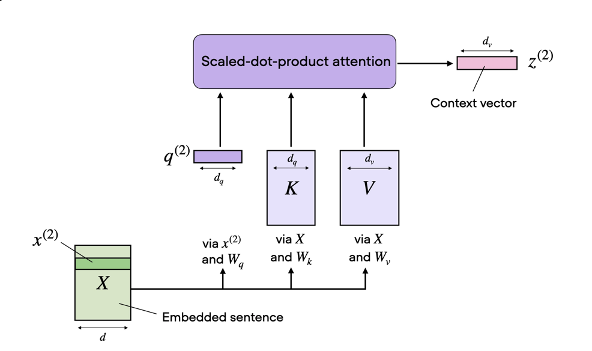
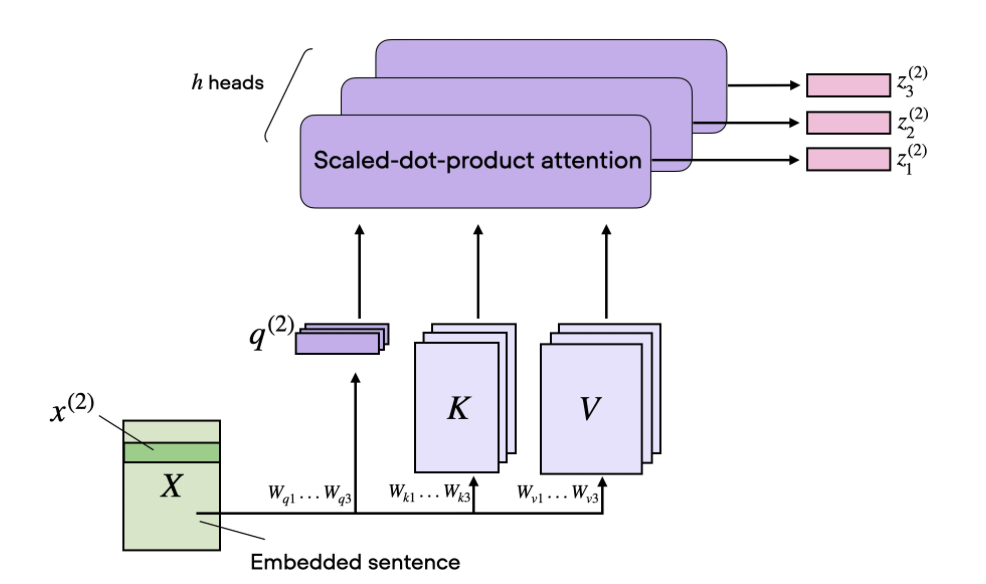
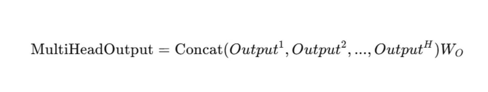

# Attention

## Queries, Keys, and Values

In the attention mechanism we do not use the raw token embeddings directly to gather information and learn features. Instead, all tokens are linearly transformed by multiplying with three different matrices: the query matrix $W_q$, key matrix $W_k$, and value matrix $W_v$. This allows the attention mechanism to learn richer representations.

The QKV mechanism can be best described by how database retrieval works. The query represents what information is being looked for, the key represents what information is stored, and the value represents what information should be contributed. The way this works is by computing the dot product for every token (the query) in the sequence with all other tokens in the sequence (the key). If the dot product is high, it means that the key token embedding aligns with the query token embedding, and if the product is low it means the key provides no information to the query token. The dot products are then normalized using softmax to turn the scores into a probability distribution (also referred to as attention weights). The weights scale the value tokens (how much information should be provided) before summing.

## Scaled Dot-Product Attention

Before computing the probability distribution via softmax, the dot products are scaled by the square root of the key embedding dimension $d_k$. This is done to ensure that the attention weights do not become too large, which could hurt numerical stability.

Assume that the components of the query vector $\mathbf{q}$ and key vector $\mathbf{k}$ are independent random variables with mean $0$ and variance $1$. When we compute the dot product:

$$\mathbf{q} \cdot \mathbf{k} = \sum_{i=1}^{d_k} q_i k_i$$

The mean of each product term is:

$$E[q_i k_i] = E[q_i]\, E[k_i] = 0$$

The variance of each product term is:

$$\text{Var}(q_i k_i) = \text{Var}(q_i)\, \text{Var}(k_i) = 1 \times 1 = 1$$

So the variance of the full dot product sums over all $d_k$ independent terms:

$$\text{Var}(\mathbf{q} \cdot \mathbf{k}) = \sum_{i=1}^{d_k} \text{Var}(q_i k_i) = d_k$$

As the dimension grows (e.g. $d_k = 64$ or $d_k = 1024$), the variance of the dot products becomes quite large, meaning they can take very large or very small values. This is then passed through the softmax layer:

$$\text{softmax}(\mathbf{z})_i = \frac{e^{z_i}}{\sum_j e^{z_j}}$$

The largest value will dominate the exponentiation step, making the outputs peaky (closer to $1$ for the max value and closer to $0$ for all others). During backpropagation the gradients flowing back get multiplied by these near-zero values, causing the vanishing gradient problem and hurting the learning process.

By scaling by $\sqrt{d_k}$ before passing through softmax, we counteract this variance growth. Using the property $\text{Var}(aX) = a^2\, \text{Var}(X)$:

$$\text{Var}\!\left(\frac{\mathbf{q} \cdot \mathbf{k}}{\sqrt{d_k}}\right) = \left(\frac{1}{\sqrt{d_k}}\right)^2 \text{Var}(\mathbf{q} \cdot \mathbf{k}) = \frac{1}{d_k} \cdot d_k = 1$$

The scaling pulls the variance of the attention logits back to $1$ regardless of the dimension size, avoiding saturation and ensuring that healthy, non-zero gradients flow backward through the network during optimization.

## Self-Attention

The attention mechanism lets each token in a sequence look at every other token and decide how much to weight their information when computing its own representation.

Assume there is a sequence $X$ with $T$ tokens, where each token embedding is of dimension $d_e$. We first take each element of the embedding sequence $X$ and multiply it with three weight matrices $W_q$, $W_k$, and $W_v$:

$$\mathbf{q}^{(i)} = W_q\, \mathbf{x}^{(i)}, \quad i \in \{1, \ldots, T\}$$

$$\mathbf{k}^{(i)} = W_k\, \mathbf{x}^{(i)}, \quad i \in \{1, \ldots, T\}$$

$$\mathbf{v}^{(i)} = W_v\, \mathbf{x}^{(i)}, \quad i \in \{1, \ldots, T\}$$

The index $i$ is the position of the token in the input sequence. The output dimension $d_k$ of these weight matrices is a hyperparameter.

Each query $\mathbf{q}^{(i)}$ is then multiplied with all keys $\mathbf{k}^{(j)}$ to get the unnormalized attention weights:

$$w_{ij} = \mathbf{q}^{(i)} \cdot \mathbf{k}^{(j)}$$

where $w_{ij}$ is the unnormalized weight between query $i$ and key $j$. Computing this for all query-key pairs produces a $T \times T$ weight matrix.

We then scale and pass this matrix through softmax to get normalized attention scores. Every element $(i, j)$ in the normalized matrix shows how well query $i$ aligns with key $j$ in the sequence — the higher the score, the more information the key provides to the query token.

Finally, we compute the context vector by multiplying the normalized scores by the value embeddings, giving the full formula:

$$\text{Attention}(Q, K, V) = \text{softmax}\!\left(\frac{Q K^\top}{\sqrt{d_k}}\right) V$$

```python
# get the scaling factor
dk = keys.shape[-1]
scale = dk ** 0.5

# calculate the unnormalized attention weights
attn = einsum(queries, keys, "... m dk, ... n dk -> ... m n")
# scaled attention
scaled_attn = attn / scale
normalized_scaled_attn = softmax(scaled_attn, -1)

out = einsum(normalized_scaled_attn, values,"... m n, ... n dk -> ... m dk")
return out
```

## Multi-Head Attention
The image below shows a single attention head that we computed earlier.


But in practice we stack multiple attention heads together. This is done by running multiple single attention heads in parallel, each with their own separate query, key, and value matrices. Having multiple attention heads allows us to learn better feature representations. A common example: one head could be learning the dependencies of pronouns to nouns in the input sequence, while another could be learning the relationship between nouns and adjectives. Each head has its own specialization that reflects teh real structure language that is learnt automagically while training.



The combined effect each head is then combined using a weighted sum shown in the diagram below 



```python

class MHSA(nn.Module):
    """
    Implementation of Multihead Self Attention
    """
    def __init__(self, d_model, num_heads, theta=None, max_seq_len=None, device=None):
        super().__init__()
        # embedding dimension
        self.d_model = d_model
        # num of heads
        self.num_heads = num_heads
        # embedding dimension of each head
        self.head_dim = d_model // num_heads
        self.device = device
        self.max_seq_len = max_seq_len
        
        # Wq, Wk, Wv Matrices
        self.q_proj = Linear(d_model, d_model, device=device)
        self.k_proj = Linear(d_model, d_model, device=device)
        self.v_proj = Linear(d_model, d_model, device=device)
        # Additional Wo matrix to get combined effect all heads
        self.o_proj = Linear(d_model, d_model, device=device)

    def forward(self, x):
        # Queries
        q = self.q_proj(x)
        # Rearrange from shape seq_len, d_model -> num_heads, seq_len, d_model
        q = rearrange(
            q,
            "... s (nh nd) -> ... nh s nd ",
            nh=self.num_heads,
            nd=self.head_dim
        )
        # Keys
        k = self.k_proj(x)
        # Rearrange from shape seq_len, d_model -> num_heads, seq_len, d_model
        k = rearrange(
            k,
            "... s (nh nd) -> ... nh s nd ",
            nh=self.num_heads,
            nd=self.head_dim
        )
        # Values
        v = self.v_proj(x)
        # Rearrange from shape seq_len, d_model -> num_heads, seq_len, d_model
        v = rearrange(
            v,
            "... s (nh nd) -> ... nh s nd ",
            nh=self.num_heads,
            nd=self.head_dim
        )

        # scaled attentions
        dk = self.head_dim
        scale = dk ** 0.5
        attn = einsum(q, k,"... h m dh, ... h n dh -> ... h m n")
        scaled_attn = attn / scale
        # apply masking
        L = attn.shape[-1]
        mask = torch.tril(torch.ones(L, L, device=x.device), diagonal=0).to(torch.bool)
        scaled_attn = torch.masked_fill(scaled_attn, ~mask, float("-inf"))
        # normalized attention
        normalized_scaled_attn = softmax(scaled_attn, -1)

        # context vector i.e. dot product of norm attn with values
        out = einsum(normalized_scaled_attn, v,"... h m n, ... h n d -> ... h m d")
        # rearrange from num_heads, seq_length, head_dim -> seq_len, d_model
        out = rearrange(
            out,
            "... nh s hd -> ... s (nh hd)",
            nh=self.num_heads,
            hd = self.head_dim
            )
        # combine effects of all head
        out = self.o_proj(out)
        
        return out
```

Reference: 
1. https://sebastianraschka.com/blog/2023/self-attention-from-scratch.html
2. Attention is all you need https://arxiv.org/pdf/1706.03762

Further Reading:
1. https://mbrenndoerfer.com/writing/self-attention-concept
