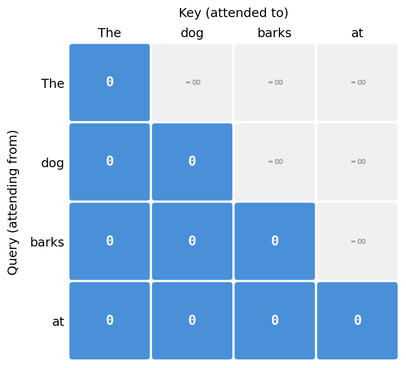

# Types of Attention

## Causal (Masked) Self-Attention

Causal self-attention is used in decoder-only models like GPT. In standard self-attention, every token attends to all other tokens in the sequence. But in causal self-attention the task is to predict the next token given the tokens seen so far. To enforce this during training, future tokens are masked so the model can only attend to past and current tokens.

This can be illustrated with the sentence "The dog barks at the mailman." During training, the model is given the tokens on the left and must predict the next token on the right:

```
The              → dog
The dog          → barks
The dog barks    → at
The dog barks at → the
...
```

**How the mask is applied.** Recall that attention scores are computed as $\frac{QK^\top}{\sqrt{d_k}}$, producing a $T \times T$ matrix. To prevent token $i$ from attending to any token $j > i$, we add a mask $M$ to the scores before the softmax, where future positions are set to $-\infty$:

$$M_{ij} = \begin{cases} 0 & \text{if } j \leq i \\ -\infty & \text{if } j > i \end{cases}$$

The masked attention formula becomes:

$$\text{Attention}(Q, K, V) = \text{softmax}\!\left(\frac{QK^\top}{\sqrt{d_k}} + M\right) V$$

Since $e^{-\infty} = 0$, the softmax naturally assigns zero weight to all future positions. For a sequence of length $T = 4$, the mask looks like:

$$M = \begin{pmatrix} 0 & -\infty & -\infty & -\infty \\ 0 & 0 & -\infty & -\infty \\ 0 & 0 & 0 & -\infty \\ 0 & 0 & 0 & 0 \end{pmatrix}$$



```python
T = queries.shape[-2]
# upper triangle (excluding diagonal) filled with -inf
mask = torch.triu(torch.full((T, T), float('-inf')), diagonal=1)

scaled_attn = attn / scale + mask
normalized_scaled_attn = softmax(scaled_attn, -1)

out = einsum(normalized_scaled_attn, values, "... m n, ... n dk -> ... m dk")
```

## Cross-Attention

Used in encoder-decoder models. Queries come from the decoder; keys and values come from the encoder output.

## Multi-Query Attention (MQA)

## Grouped-Query Attention (GQA)

## Flash Attention

*Coming soon.*
