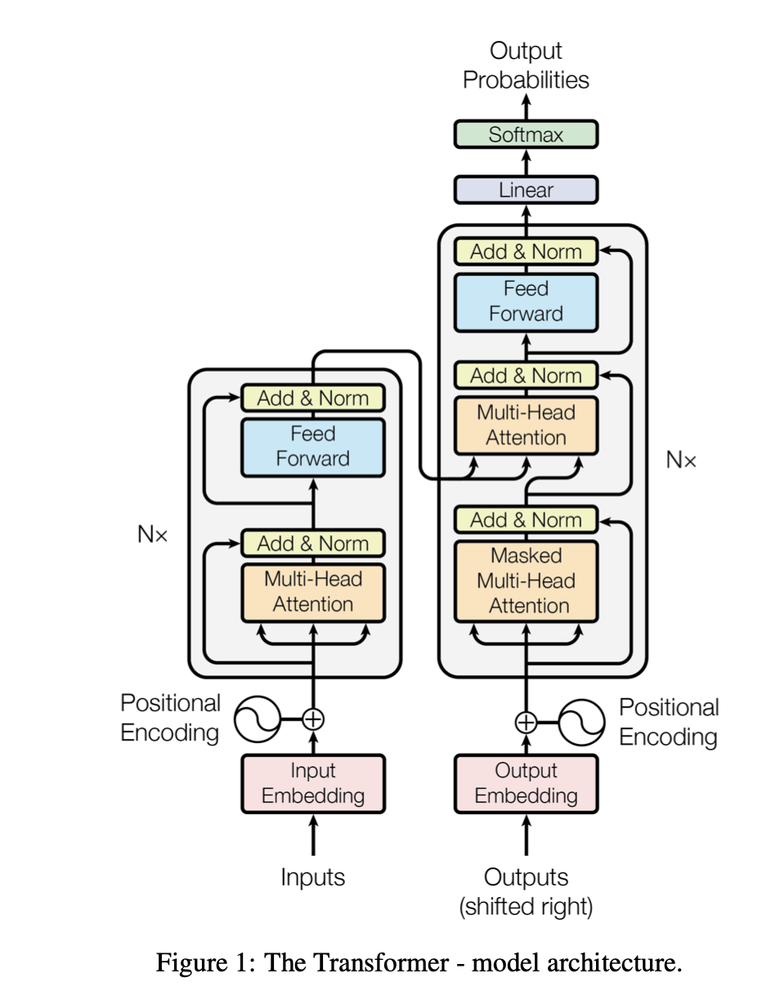
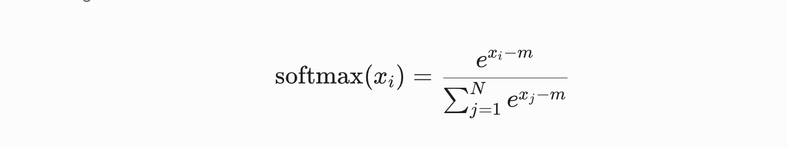

# Types of Attention

## Causal (Masked) Self-Attention

Causal self-attention is used in decoder-only models like GPT. In standard self-attention, every token attends to all other tokens in the sequence. But in causal self-attention the task is to predict the next token given the tokens seen so far. To enforce this during training, future tokens are masked so the model can only attend to past and current tokens.

This can be illustrated with the sentence "The dog barks at the mailman." During training, the model is given the tokens on the left and must predict the next token on the right:

```
The              → dog
The dog          → barks
The dog barks    → at
The dog barks at → the
...
```

**How the mask is applied.** Recall that attention scores are computed as $\frac{QK^\top}{\sqrt{d_k}}$, producing a $T \times T$ matrix. To prevent token $i$ from attending to any token $j > i$, we add a mask $M$ to the scores before the softmax, where future positions are set to $-\infty$:

$$M_{ij} = \begin{cases} 0 & \text{if } j \leq i \\ -\infty & \text{if } j > i \end{cases}$$

The masked attention formula becomes:

$$\text{Attention}(Q, K, V) = \text{softmax}\!\left(\frac{QK^\top}{\sqrt{d_k}} + M\right) V$$

Since $e^{-\infty} = 0$, the softmax naturally assigns zero weight to all future positions. For a sequence of length $T = 4$, the mask looks like:

$$M = \begin{pmatrix} 0 & -\infty & -\infty & -\infty \\ 0 & 0 & -\infty & -\infty \\ 0 & 0 & 0 & -\infty \\ 0 & 0 & 0 & 0 \end{pmatrix}$$


```python
T = queries.shape[-2]
# upper triangle (excluding diagonal) filled with -inf
mask = torch.triu(torch.full((T, T), float('-inf')), diagonal=1)

scaled_attn = attn / scale + mask
normalized_scaled_attn = softmax(scaled_attn, -1)

out = einsum(normalized_scaled_attn, values, "... m n, ... n dk -> ... m dk")
```

## Cross-Attention

In self-attention, the queries, keys, and values come from the same input sequence. But in cross-attention, we combine two different input sequences. In the original transformer paper (diagram below), the sequence from the encoder module and the sequence from the decoder interact via cross-attention. In this case, the decoder provides the queries, and the encoder provides the keys and values.



## Multi-Query Attention (MQA)

In multi-head attention, each head has its own key and value matrices. This takes a lot of memory. One of the ways to mitigate this was to have a single key and value matrix and share them across the different heads. This saves on memory and computation but comes with a cost — the models are not as expressive (lower accuracy).

## Grouped-Query Attention (GQA)

Alternatively, instead of reducing the number of key and value matrices aggressively from the number of heads to just 1, we can opt for a middle ground where groups of heads share key and value matrices. Thus, we end up with H // G key-value pairs, each shared among G heads. For example, if there were 8 heads originally and we set the group size to 2, there would be 4 key and value matrices — heads H1 and H2 would use 1 set, H3 and H4 would use another, ..., and H7 and H8 would use the 4th set.

This strikes a balance between computation and expressiveness (learning ability).

## Flash Attention

The memory and computation complexity of the attention mechanism is $O(n^2)$.

The key idea is to avoid reading and writing the full attention matrix to and from DRAM. It computes the exact same standard attention output but dramatically reduces memory usage to $O(n)$.

To understand why standard attention struggles, we need to understand how a GPU is built. It has two major components:

* **HBM (High Bandwidth Memory):** Holds massive amounts of data — 40 GB to 80 GB.
* **SRAM (Static RAM):** Where computation is done, but has only 20 MB of memory.

In the standard attention mechanism:

1. The GPU loads the Q and K matrices from the slow HBM into SRAM.
2. It computes the attention scores $S$.
3. **The bottleneck:** $S$ is too large to be held in SRAM, so it must be written back to HBM.
4. The GPU then has to read $S$ back from HBM into SRAM to apply the softmax.
5. It writes it back to HBM, and then reads it again to multiply with the value matrix $V$.

The constant reading and writing wastes a lot of time. These are memory-bound bottlenecks.

The way to mitigate this is, instead of doing these operations all at once, to break them into chunks, compute, and write back to memory. This technique is called tiling.



Recall that when computing the softmax, we subtract the max value in the row for numerical stability. But because we now compute in tiles, we do not know the maximum value upfront. To get around this, we keep track of a running maximum and running sum for each block.

**Online Softmax**

For example, `[2, 5, 8, 4]` are the raw attention scores.

**Step 1: Process Block 1 [2, 5]**

- Local max: $m_\text{old} = 5$
- Exponentials: $e^{2-5}$ and $e^{5-5}$
- Running sum: $e^{-3} + 1$

**Step 2: Process Block 2 [8, 4]**

- Local max: $m_\text{new} = 8$
- Correction factor: $e^{m_\text{old} - m_\text{new}} = e^{5-8} = e^{-3}$
- Exponentials: $e^{8-8}$ and $e^{4-8}$
- Updated sum: $(e^{-3} + 1) \cdot e^{-3} + e^{0} + e^{-4}$


References:
1. Attention is all you need https://arxiv.org/pdf/1706.03762
2. How Attention Got so Efficient https://www.youtube.com/watch?v=Y-o545eYjXM