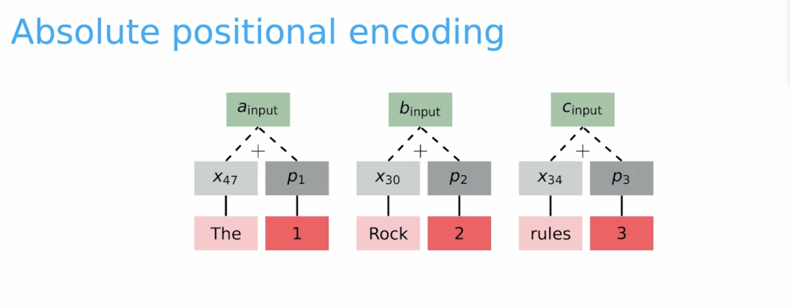
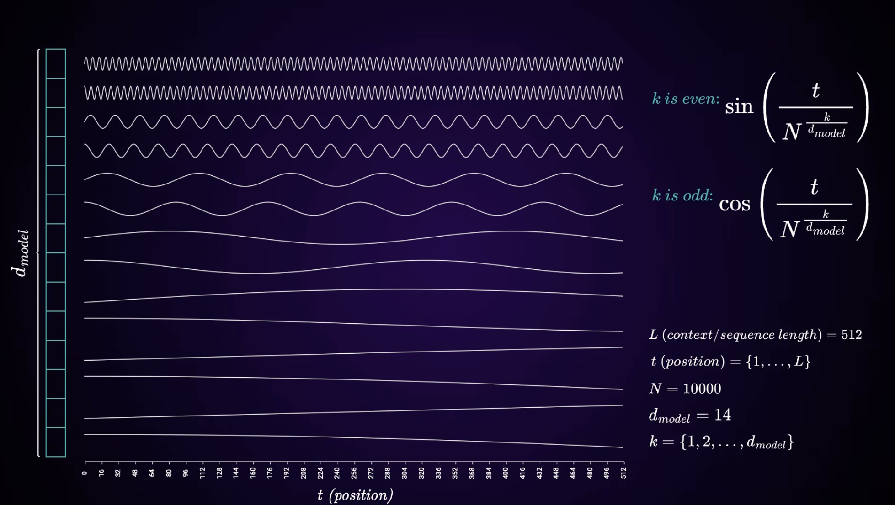

# Embeddings

Token IDs are integers — they carry no meaning on their own. Large language models map these IDs to an array of real numbers in continuous space where semantically similar tokens end up close together.

## Token Embeddings
After the text is broken down into raw textual units (tokens) and the corresponding IDs have been assigned, an embedding table is used to convert these token IDs into something meaningful that can be understood by the model. One can think of it as a lookup table — a matrix of `vocab_size x embedding_dim`. For each token ID, the table is indexed and the token's corresponding embedding is retrieved.

The same embedding matrix is reused (transposed) as the final output projection to get back the vocabulary.

## Positional Encodings
Unlike CNNs that have spatial inductive bias, the transformer architecture does not know the position of tokens that are fed into it. The operations are just dot products, and these are not directional. In order to help the model know the order of the input sequence, we add positional encodings to the token embeddings.

These encodings can either be learnt by the model, or computed using a fixed formula. One key idea is that positional encodings are *added* to the token embeddings and *not appended*. The drawback of appending is that the embedding dimension would increase, making the model computationally expensive; simple addition works and the model is still able to learn.

### Absolute
The easiest way to go about adding positional information would be to just add the token position in the input sequence.



But this has two major drawbacks:
1. Sets of positions need to be decided ahead of time.
2. May hinder generalization of tokens in different positions.


### Sinusoidal (original Transformer)
The original paper proposed using sine and cosine wave functions to encode positional embeddings. Using these formulas:

\[PE_{(pos,\ 2i)} = \sin\!\left(\frac{pos}{10000^{2i/d_{\text{model}}}}\right)\]

\[PE_{(pos,\ 2i+1)} = \cos\!\left(\frac{pos}{10000^{2i/d_{\text{model}}}}\right)\]

Where \(pos\) is the token's position in the sequence, \(i\) is the dimension index, and \(d_{\text{model}}\) is the embedding size. Even dimensions use sine, odd dimensions use cosine.



The idea behind using this was:

a. These are smooth periodic functions.
b. Since they are frequency bands, it would be easy for the model to find the positional difference between the encodings.
c. No additional parameters to learn.

The drawbacks are:

~~1. Sets of positions need to be decided ahead of time.~~
2. May hinder generalization of tokens in different positions.

### Learned Absolute
Instead of a fixed formula, the model learns a trainable matrix of shape `max_seq_len × d_model` — one vector per position — updated during training like any other parameter. Used in BERT and early GPT models.

The drawback is that the model cannot generalize beyond `max_seq_len`. If trained on sequences up to length 512, position 513 has no learned vector and the model has no way to handle it.

### RoPE (Rotary Position Embedding)
The biggest drawback of using sinusoidal encodings was that these are still absolute positional encodings. The network has to learn the meaning of a word at its absolute position.

For example, take these two sentences: *My daughter called me last night* & *Last night my daughter called me*. If you look at the order of the words "my daughter called" in both sentences, you can see we care more about the relative positions of the words rather than their absolute positions. Moreover, having relative positions makes the representation invariant to shift. Thus, the attention score between a query and key vector should be based on the content (embeddings) and relative distance (m-n).

\[Score = f(q, k, m-n)\]

We only apply RoPE to the query and key vectors. It is applied in every single attention block.

Think of the embedding vector as having semantic meaning represented via its norm \(\|q\|\) and its token position represented by its direction theta. To give relative positions with respect to some vector we can rotate it by some angle.

But most of these models have large embedding dimensions. For e.g., if the embedding dim is 4096, to rotate it we would need a 4096 x 4096 matrix. This is computationally expensive! The solution is that instead of doing one large rotation, the array is broken down into pairs, and then these pairs are rotated. These pairs are rotated at different speeds — if the same speed were used it would make the rotation ambiguous.

The kth pair is rotated using this formula:

\[\theta_k = 10000^{-2k/d}\]

The way that the algorithm works is:

1. Precompute all the angles
    - get the frequencies
    - calculate the rotations
    - create a lookup table (rots) for the max_seq_len
2. Apply the rotations to the tokens using the lookup table
    - Separate even and odd positions
    - apply rotation formula
    - merge the positions back

Implementation of RoPE
```python
class RoPE(nn.Module):
    def __init__(self, theta, d_k, max_seq_len, device=None):
        super().__init__()
        self.theta = theta # angle for rope
        self.d_k = d_k # dimension of query and key vectors
        self.max_seq_len = max_seq_len # max seq len of input
        self.device = device # device to store buffer on

        #calculate the frequencies
        k = torch.arange(0, d_k, 2)
        # calculate the denominator
        denominator = torch.pow(theta, -k/ d_k)
        # positions
        positions = torch.arange(max_seq_len)
        # what position gets rotated by what amount
        rots = torch.outer(positions, denominator)
        # register as a non learnable parameter
        self.register_buffer('rotations', rots ,persistent=False)


    def forward(self, x, token_positions):
        # extract the rotations from token_positions
        rots = self.rotations[token_positions,:]
        # separate even and odds
        evens, odds = x[..., 0::2], x[..., 1::2] 
        # apply rotation formula
        evens_new = evens * torch.cos(rots) - odds * torch.sin(rots)
        odds_new = evens * torch.sin(rots) + odds * torch.cos(rots)
        # combine them
        out = torch.stack([evens_new, odds_new], dim=-1)
        # make output dim equal to input dims otherwise dk//2, 2
        out = out.flatten(start_dim=-2)
        return out
```

References:

1. CS336
2. <https://www.youtube.com/watch?v=JERXX2Byr90>
3. <https://www.youtube.com/watch?v=T3OT8kqoqjc>
4. <https://www.youtube.com/watch?v=hCzJo4ui1P8>
