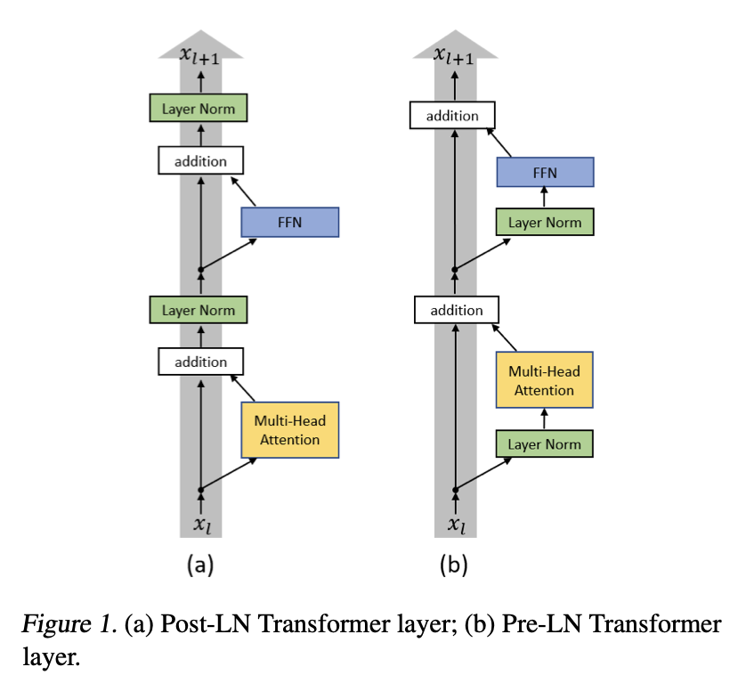

# Pre-Norm vs Post-Norm

Where normalization is applied relative to the residual connection has a large effect on training stability.

In the original transformer paper, layer normalization was applied after the residual addition (Post-Norm), that is, inside the residual stream.

Having residual connections in large models serves two purposes. Firstly, the model can learn the identity function (if deeper layers are redundant or unnecessary to performance). Secondly, it provides a gradient highway, a path unimpeded by consecutive matrix multiplications that prevents vanishing gradients.

$$H(x) = x + F(x)$$

Placing the layer norm inside the residual stream can be thought of as impeding the gradient highway, which then leads to training instability. When backpropagating through $\text{LayerNorm}(x + F(x))$, the normalization re-scales the gradient before it reaches $x$, so the clean $\frac{\partial H}{\partial x} = 1$ path no longer exists. In Pre-Norm, the residual $x$ bypasses LayerNorm entirely, meaning that $1$ always flows back unchanged — this is what keeps the gradient highway truly unimpeded.

Instead, it was found that applying the layer norm before the attention mechanism or the FFN (Pre-Norm) leads to better training dynamics. It was found [1] that using this setup can reach comparable results to the baseline with less training time and hyperparameter tuning.

**Post-Norm**

$$\text{Output} = \text{LayerNorm}(x + \text{SubLayer}(x))$$

**Pre-Norm**

$$\text{Output} = x + \text{SubLayer}(\text{LayerNorm}(x))$$

References:
1. On Layer Normalization in Transformer Architecture https://arxiv.org/pdf/2002.04745