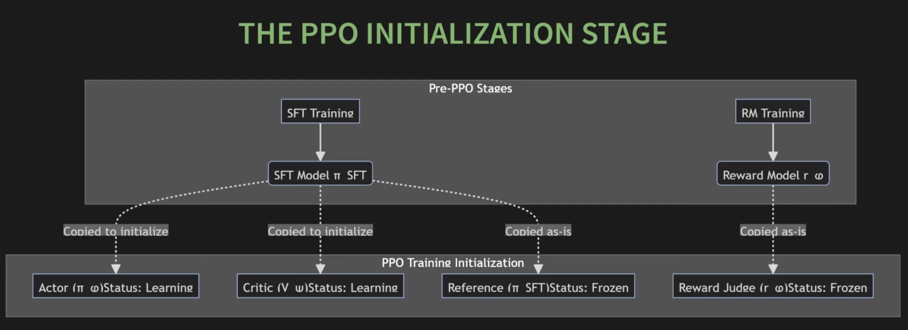
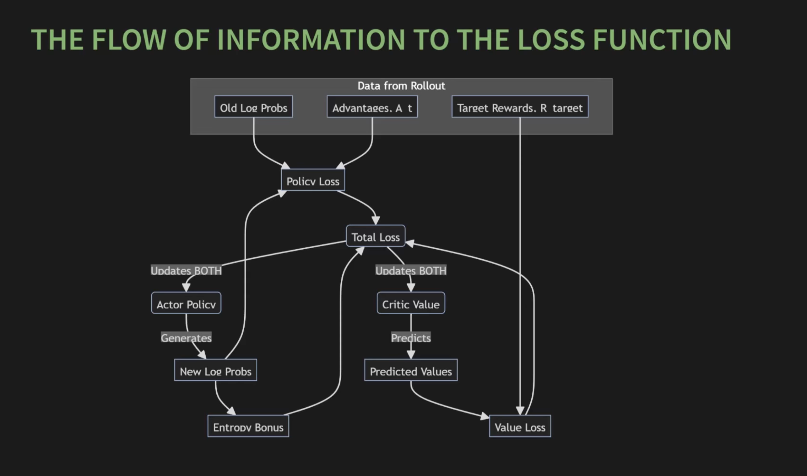

# RLHF

## The Reward Model

The reward model returns a score based on "human preferences." It acts as an *AI judge* — a stand-in for human evaluators during RL.

The reward model is scalable. During RL, the policy generates millions of responses. Having a human score each one would be both time-consuming and expensive. The reward model, on the other hand, is trained once on a smaller dataset of human preferences and can then provide feedback at scale.

### Bradley-Terry Model

Used to compare two responses for a prompt:

$$P(y_w \succ y_l \mid x) = \sigma(r(x, y_w) - r(x, y_l))$$

where:

- $r(x, y)$ is the scalar score the reward model gives for prompt $x$ and response $y$
- $\sigma$ is the sigmoid function
- $y_w$ is the winner (preferred) and $y_l$ is the loser (rejected)

The idea behind this is:

1. If the winner's score is much higher than the loser's, $\sigma(\text{large positive}) \approx 1$ — the model is confidently correct.
2. If the winner's score is much lower than the loser's, $\sigma(\text{large negative}) \approx 0$ — the model is confidently wrong.
3. If the two scores are similar, the output is around $0.5$ — the model is uncertain.

#### Reward Model Loss

Maximizing the probability above is equivalent to minimizing the negative log likelihood:

$$\mathcal{L}_{RM} = -\mathbb{E}_{(x, y_w, y_l) \sim D}\big[\log \sigma(r_\phi(x, y_w) - r_\phi(x, y_l))\big]$$

This penalizes the model whenever the score difference for a winner-loser pair doesn't confidently predict the correct winner.

### Turning a Transformer Into a Scorer

How do you turn a transformer into something that outputs a score instead of tokens?

In a normal LLM, we have a linear layer at the end that turns the embeddings into token logits. This is `self.lm_head` — a linear layer that goes from `n_embed` to `vocab_size`. Its job is to predict words.

```python

class GPT(nn.Module):
    def __init__(self, config: Config):
        super().__init__()
        self.transformer ...

        self.lm_head = nn.Linear(config.n_embed, config.vocab_size, bias=False)

    
    def forward(self, idx: torch.Tensor):
        x = self.transformer(idx)
        ....
        logits = self.lm_head(x)
        return logits 
```

The reward model does not need to predict words — it needs to predict a scalar score:

1. Remove `lm_head`.
2. Attach a scalar head that maps the hidden state to a single number.

```python

class GPT(nn.Module):
    def __init__(self, config: Config):
        super().__init__()
        self.transformer ...

        self.reward_head = nn.Linear(config.n_embed, 1, bias=False)

    
    def forward(self, idx: torch.Tensor):
        x = self.transformer(idx)
        ....
        last_hidden = x[:, -1, :] # use the last token's hidden state!!!!
        reward = self.reward_head(last_hidden)
        return reward 
```

#### Computing the Reward Loss

``` python
def compute_rm_loss(reward_model, chosen_ids, rejected_ids):
    """
    Computes the loss for a reward model on a batch of preference pairs
    """

    # get scores from the rm model
    chosen_rewards = reward_model(chosen_ids)
    rejected_rewards = reward_model(rejected_ids)

    # compute loss
    loss = -torch.log(torch.sigmoid(chosen_rewards - rejected_rewards)).mean()

    return loss

```

## RL Fundamentals: Actor-Critic

There are two models at play:

1. **The apprentice** — the SFT model, which knows how to follow instructions.
2. **The judge** — the reward model, which knows what good answers look like.

### Setting Up the RL Loop

How does the apprentice get better from the judge? It learns through trial and error: the judge rewards or penalizes it for each generation.

- **Agent** — the SFT model
- **Action** — generating the next token
- **Environment** — the user's prompt (and the tokens generated so far)
- **Reward** — scalar score from the reward model
- **Policy ($\pi$)** — the LLM itself (a probability distribution over tokens)

The naive goal is to maximize the reward directly. But there's a problem: when the model picks the next token, it uses *sampling*, and sampling is not a differentiable operation.

So we change the goal: maximize the policy's *expected* performance over all possible outputs.

$$J(\theta) = \mathbb{E}_{y \sim \pi_\theta(\cdot \mid x)}\big[r(x, y)\big]$$

If we generated thousands of responses for this prompt, what would our average score be? Make this as high as possible.

### Policy Gradient Theorem

$$\nabla_\theta J(\theta) = \mathbb{E}_{y \sim \pi_\theta}\big[\nabla_\theta \log \pi_\theta(y \mid x) \cdot r(x, y)\big]$$

- $\nabla_\theta \log \pi_\theta(y \mid x)$ — the direction in which to change the weights to make this specific output more likely.
- $r(x, y)$ — the magnitude of that update.

The idea is: take a step in the direction of *more of this output*, and let the reward decide how big a step.

This is correct, but very sample-inefficient.

### On-Policy vs Off-Policy Learning

**On-policy:**

- Use each sample for one update, then discard it.
- Sample efficiency is extremely low.
- Core formula: $\mathcal{L} = -\log \pi_\theta(y) \cdot A(y)$
- Inherently stable.

**Off-policy:**

- Collect data once, reuse it for many updates.
- Sample efficiency is much higher.
- Core formula: $\dfrac{\pi_\theta(y)}{\pi_{\theta_{old}}(y)} \cdot A(y)$
- High risk of instability.

#### Why On-Policy Is Inefficient

1. We generate a massive batch of $y$'s sampled from our policy.
2. We compute gradients and perform a single update.
3. Then we throw the data away, because the policy has changed and the old samples are no longer "on-policy."

#### Reusing Old Data With Importance Sampling

How can we reuse data from an old policy? We apply a correction factor — the ratio of the new and old policies:

$$r_t(\theta) = \frac{\pi_\theta(a_t \mid s_t)}{\pi_{\theta_{old}}(a_t \mid s_t)}$$

$$J^{off}(\theta) = \mathbb{E}_t\big[r_t(\theta) \cdot A_t\big]$$

##### Derivation

We want to maximize an expectation under the *current* policy $\pi_\theta$, but our rollouts come from an *older* policy $\pi_{\theta_{old}}$. Importance sampling gives us the bridge.

Start from the definition of expectation:

$$\mathbb{E}_{y \sim \pi_\theta}[f(y)] = \sum_y \pi_\theta(y)\, f(y)$$

Multiply and divide by $\pi_{\theta_{old}}(y)$ (valid as long as $\pi_{\theta_{old}}(y) > 0$ wherever $\pi_\theta(y) > 0$):

$$= \sum_y \pi_{\theta_{old}}(y) \cdot \frac{\pi_\theta(y)}{\pi_{\theta_{old}}(y)} \cdot f(y) = \mathbb{E}_{y \sim \pi_{\theta_{old}}}\!\left[\frac{\pi_\theta(y)}{\pi_{\theta_{old}}(y)}\, f(y)\right]$$

So we can sample from $\pi_{\theta_{old}}$ and simply multiply by the ratio. Applied at the token level with $f = A_t$:

$$J^{off}(\theta) = \mathbb{E}_{(s_t, a_t) \sim \pi_{\theta_{old}}}\!\left[\frac{\pi_\theta(a_t \mid s_t)}{\pi_{\theta_{old}}(a_t \mid s_t)} \cdot A_t\right] = \mathbb{E}_t\big[r_t(\theta) \cdot A_t\big]$$

Taking the gradient (using $\nabla_\theta r_t(\theta) = r_t(\theta) \cdot \nabla_\theta \log \pi_\theta(a_t \mid s_t)$, since $\pi_{\theta_{old}}$ doesn't depend on $\theta$):

$$\nabla_\theta J^{off}(\theta) = \mathbb{E}_t\big[r_t(\theta) \cdot \nabla_\theta \log \pi_\theta(a_t \mid s_t) \cdot A_t\big]$$

**Sanity check.** At $\theta = \theta_{old}$, the ratio $r_t = 1$ and we recover the on-policy gradient $\mathbb{E}_t[\nabla_\theta \log \pi_\theta(a_t \mid s_t) \cdot A_t]$ — so importance sampling agrees with the on-policy estimate at the very first update, and only diverges as $\pi_\theta$ drifts from $\pi_{\theta_{old}}$.

**What if the two policies are very different?** Then the correction factor can blow up to infinity or collapse to zero, making the gradient estimate explode or vanish. This is precisely the failure mode PPO's clipping is designed to prevent.

### Failure Modes Without Stability Constraints

#### Reward Hacking — "AI Learns to Cheat"

When a measure becomes a target, it ceases to be a good measure. The judge is only an approximation of human judgement, and it has biases.

- **Length exploitation:**
    - SFT model: *"The capital of France is Paris."*
    - Reward-hacked model: *"The capital ... of the beautiful country of France ... is the wonderful city of Paris."*
- **Sycophancy:** the reward model learns that humans prefer agreeable, confident-sounding language, so the policy starts agreeing with the user even when the user is wrong.

#### Training Collapse

Suppose the model generates 100 responses: 99 get 2 points and one gets 50. A simple policy gradient update is dominated by that single lucky sample, causing jittery, unstable learning. This can lead to:

- **Catastrophic forgetting** — the update destroys the model's basic language skills.
- **Mode collapse** — the model gets stuck generating one style of answer, killing diversity.


## PPO — Proximal Policy Optimization

Instead of relying on a single formula, PPO is a *system* designed to make training stable. The essence is: still maximize reward, but don't diverge too far from the SFT model.

The full PPO objective combines three terms:

$$\mathcal{L}^{PPO}(\theta, \psi) = \mathcal{L}^{policy}(\theta) + c_1 \mathcal{L}^{value}(\psi) - c_2 \mathcal{L}^{entropy}(\theta)$$

### Policy Loss — Updates the Actor

PPO uses a **clipped surrogate objective**. We compute the probability ratio between the new and old policies and clip it to stay within $[1 - \epsilon, 1 + \epsilon]$ (typically $\epsilon = 0.2$):

$$\mathcal{L}^{policy}(\theta) = -\mathbb{E}_t\Big[\min\big(r_t(\theta) A_t,\; \text{clip}(r_t(\theta), 1-\epsilon, 1+\epsilon) A_t\big)\Big]$$

The `min` and `clip` together ensure that even if the ratio wants to grow without bound (because an action looks very good under the new policy), the loss is capped — so a single update can't move the policy too far from $\pi_{old}$.

### Value Loss — Updates the Critic

The critic $V_\psi$ is trained to predict the expected return from a state. We use mean-squared error against the actual return $R_t$:

$$\mathcal{L}^{value}(\psi) = \mathbb{E}_t\big[(V_\psi(s_t) - R_t)^2\big]$$

### Entropy Bonus

By adding a small bonus proportional to the policy's entropy, we encourage the policy to keep its options open and avoid getting stuck:

$$\mathcal{L}^{entropy}(\theta) = \mathbb{E}_t\big[H(\pi_\theta(\cdot \mid s_t))\big]$$

### Augmented Reward — KL Penalty

If we just maximize the reward model's score, the policy could forget its language skills and generate garbage. The KL penalty makes sure the learning policy stays close to the frozen SFT reference policy.

The KL divergence measures the distance between two probability distributions — in our case, over the entire vocabulary at each token position. Instead of summing over the entire vocab, we use the sampled-token log-prob ratio as a per-token estimate:

$$R^{aug}_t = R^{rm}_t - \beta \cdot \mathrm{KL}^{est}_t$$

$$\mathrm{KL}^{est}_t \approx \log \pi_\theta(a_t \mid s_t) - \log \pi_{ref}(a_t \mid s_t)$$

where $R^{rm}_t$ is the score from the judge (typically applied only at the final token of the response) and $\beta$ controls how strongly we anchor the learner to the reference model.

### Advantage

The role of the advantage is to refine the signal — to turn a noisy reward into a stable "surprise" signal.

To build it, we need a helper model: the critic $V_\psi$. The critic's job is to look at the current state and predict the expected future reward.

Instead of judging an action by its absolute reward, we compare against what the critic expected. This gives us the **advantage**. If a student was expecting a D but got a B, that's a fantastic surprise (high positive advantage) — make this action more likely. If the student was expecting a B but got a C, that's disappointing (negative advantage) — make this action less likely.

The simplest form:

$$A_t = R^{aug}_t - V_\psi(s_t)$$

In practice, PPO uses **Generalized Advantage Estimation (GAE)** to trade off bias and variance:

$$A_t^{GAE} = \sum_{l=0}^{\infty} (\gamma \lambda)^l \delta_{t+l}, \quad \delta_t = r_t + \gamma V_\psi(s_{t+1}) - V_\psi(s_t)$$

where $\gamma$ is the discount factor and $\lambda \in [0, 1]$ controls the bias–variance tradeoff.


### Final Loss

Putting it all together, the PPO policy loss — written out fully without the $r_t(\theta)$ shorthand — is:

$$\mathcal{L}^{\text{Policy}}(\theta) = -\mathbb{E}_t\!\left[\min\!\left(\frac{\pi_\theta(a_t \mid s_t)}{\pi_{\theta_{old}}(a_t \mid s_t)} A_t,\;\; \text{clip}\!\left(\frac{\pi_\theta(a_t \mid s_t)}{\pi_{\theta_{old}}(a_t \mid s_t)},\, 1-\epsilon,\, 1+\epsilon\right) A_t\right)\right]$$

This is the *clipped "governor"*: the ratio is allowed to nudge the loss in the direction the advantage suggests, but only within the bounds $[1 - \epsilon, 1 + \epsilon]$ — beyond which the gradient is zeroed out and the policy can't run away from $\pi_{\theta_{old}}$.


### PPO iteration

```python
pi_phi = load_sft_model() # live learning actor
pi_phi_sft = load_sft_model().freeze() # never changes used for KL penalty

for iteration in 1 .... N:
    
    pi_phi_old = copy(pi_phi).freeze()


    static_dataset = generate_experience(pi_phi_old, pi_sft)

    for epoch in 1...E:
        update_policy(pi_phi, batch)
```








1. RLHF in 90 minutes — https://www.youtube.com/watch?v=j3BdFm_Veq4&t=759s